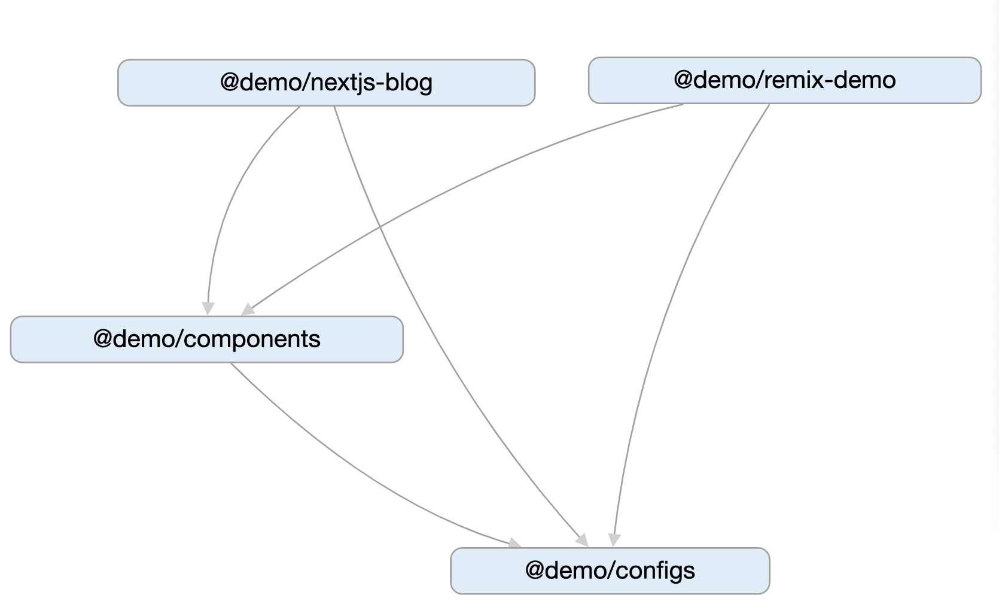

# rush-split-workspace-demo

This repo shows a demo to implement `splitWorkspace` feature in Rush.js. See original [proposal](https://github.com/octogonz/rush-split-workspace-prototype) for more details.

# Dependency graph

> created by [pnpm-workspace-graph](https://www.npmjs.com/package/pnpm-workspace-graph)

